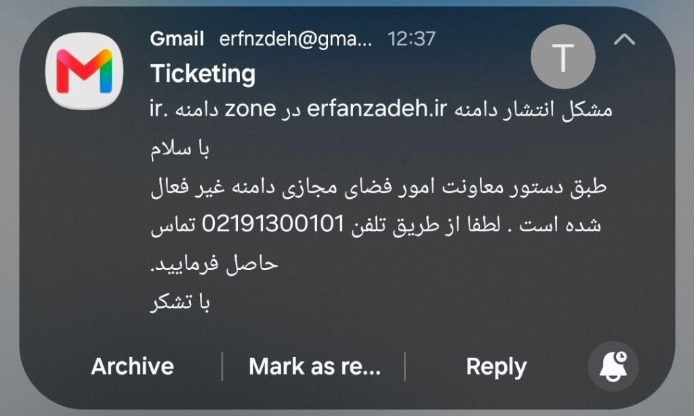

# erfanzadeh.ir

  

A minimal file sharing server written in Go. Drag-and-drop uploads, auto-eviction when storage fills up, download tracking.

During Iran’s internet blackout, this was a password-protected drop box on a domestic VPS. People used it to pass files to each other when Google Drive, Dropbox, and the usual foreign hosts were unreachable. The password was public on purpose — enough to keep casual scanners out, not enough to stop anyone who needed it.

It ran for about eleven weeks. Then IRNIC deactivated the domain on orders from the Deputy for Cyberspace Affairs.

## What it did

Strangers uploaded. Strangers downloaded. The pool capped at 10 GB and evicted old, unused files so new ones could land. Every download was counted. Every uploader IP was stored. There was no Google Analytics, no cookie, no account — just the files and the counters.

The fact that it was behind HTTP basic auth and still did this volume is the point. You had to know the password, and people still showed up.

## Lifetime usage

Counted from 29 March 2026 (when the on-disk counters already existed) through the takedown. The hard snapshot is live `/stats` on **1 June 2026**. The lifetime column scales that daily rate to **16 June** (public DNS already NXDOMAIN) — the conservative end of the public life. IRNIC confirmed the kill on **23 June**.

| | 1 June (measured) | lifetime (to 16 June) |
|---|---:|---:|
| Downloads | 968,213 | **~1.2 million** |
| Data downloaded | ~48.9 TB | **~60 TB** |
| Data uploaded | ~129.6 GB | **~160 GB** |
| Files ever uploaded | 2,554 | **~3,150** |
| Unique uploader IPs | 1,130 | **~1,260** |

That is about **15,000 downloads a day**, ~40 new files a day, and ~0.76 TB leaving the box every day. Bytes are estimates (`size × downloads` for files still on disk, average size for evicted ones). Unique IPs are **uploaders**, not visitors — we never counted pageviews. The late-period IP rate had already slowed, so the IP total is not a straight line from zero.

## Shutdown

On 23 June 2026 at 12:37 Tehran time, IRNIC ticketing replied that the domain had been deactivated by order of the Deputy for Cyberspace Affairs:

The domain had already vanished from the `.ir` zone (NXDOMAIN on `a.nic.ir` / `b.nic.ir`) when I wrote to them the night before. The VPS stayed up for a while after that. Nobody outside could resolve it.

## Contributing

See [CONTRIBUTING.md](CONTRIBUTING.md). Bugs go in
[issues](https://github.com/erfnzdeh/erfanzadeh.ir/issues). Security
reports are private: see [SECURITY.md](SECURITY.md).

## License

MIT. See [LICENSE](LICENSE).
